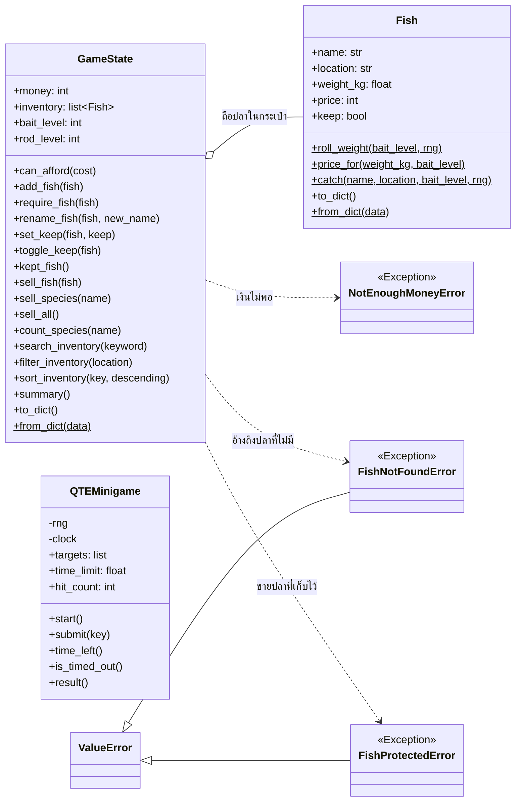
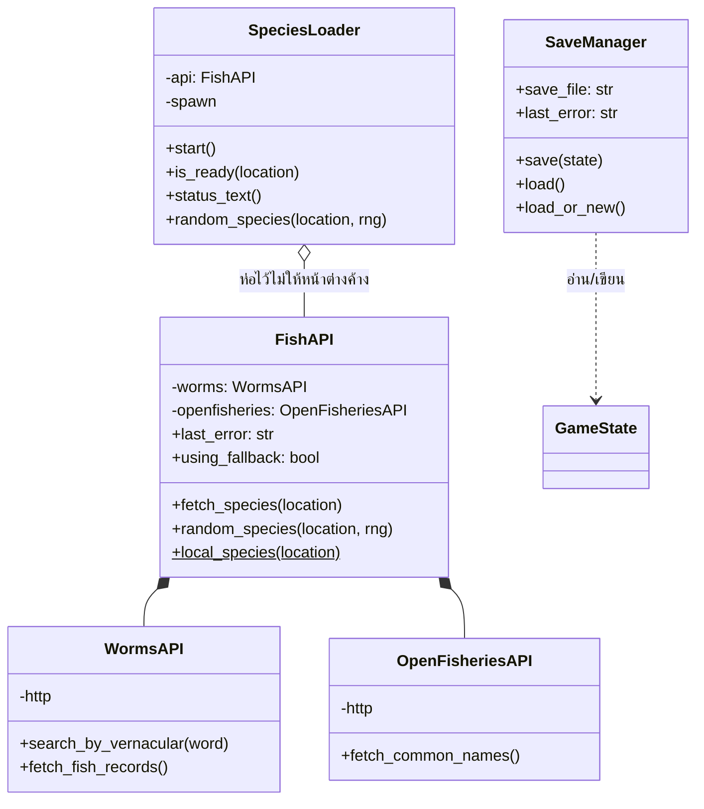
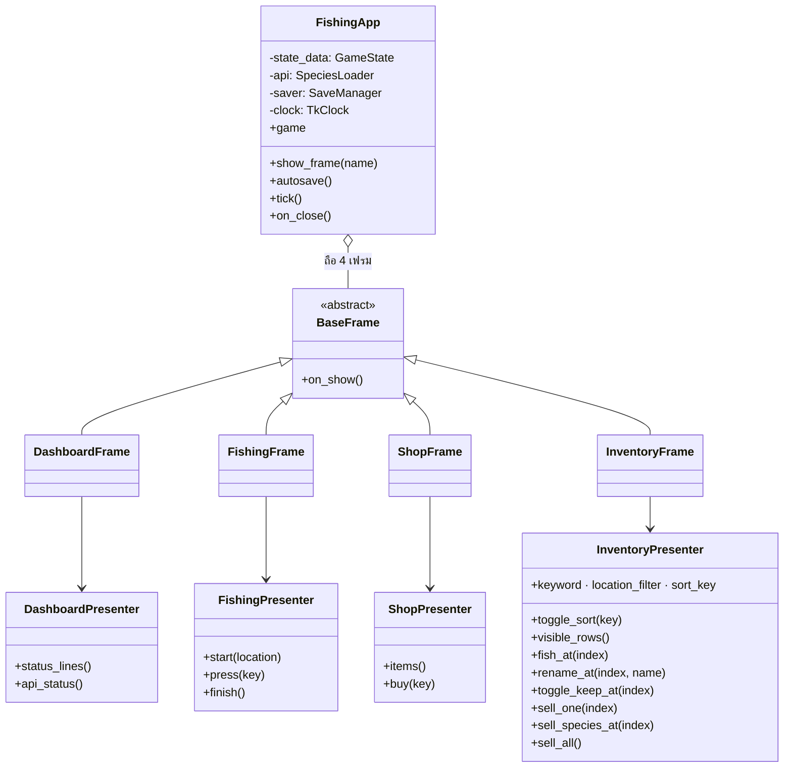

# PLAN.md — แผนงานและข้อกำหนดความสำเร็จ

**โปรเจกต์:** HOW_DO_YOU_FISH — เกมจำลองการตกปลา
**รายวิชา:** CP352301 Script Programming · ภาคปลาย 2569 · Group 7 Section 2

---

## 1. ขอบเขตระบบ (System Scope)

โปรแกรม Desktop ที่ให้ผู้เล่นเลือกสถานที่ตกปลา เล่นมินิเกมสู้แรงปลา แล้วนำปลาที่จับได้
ไปขายเพื่ออัปเกรดอุปกรณ์ ข้อมูลชนิดปลามาจาก **Public API สองตัว** คือ WoRMS (แหล่งน้ำ)
และ Open Fisheries (ชื่อสามัญภาษาอังกฤษ)
และสถานะการเล่นถูกบันทึกลงไฟล์ JSON อัตโนมัติ

**หน้าจอทั้งหมด 5 หน้า**

| หน้าจอ | หน้าที่ |
|---|---|
| เมนูหลัก | แถบสถานะ (เงิน · ปลาในกระเป๋า · เลเวลอุปกรณ์) และทางเข้าแต่ละหน้า |
| เลือกสถานที่ | ทะเลสาบน้ำจืด · ทะเลลึก · ปากแม่น้ำน้ำกร่อย |
| ตกปลา | หย่อนเบ็ด แอนิเมชันรอ และมินิเกม QTE |
| ร้านค้า | อัปเกรดเหยื่อและคันเบ็ด |
| คลังสินค้า | ค้นหา · กรอง · เรียงลำดับ · ขายปลา · สรุปสถิติ |

---

## 2. ภาพรวมแผน 4 สปรินต์

| สปรินต์ | เวอร์ชัน | สัปดาห์ | จุดเน้น | สถานะ |
|---|---|---|---|---|
| Sprint 1 | v0.1.0 | 12 | Front-End App Dev | เสร็จแล้ว |
| Sprint 2 | v0.2.0 | 13 | Back-End App Dev | เสร็จแล้ว |
| Sprint 3 | v0.3.0 | 14 | Full-Stack App Dev | เสร็จแล้ว |
| Final Sprint | v1.0.0 | 15 | DevOps, CI/CD & AI Integration | วางแผนไว้ |

**การหมุนเวียนบทบาท** — บทบาท Planner และ Debugger/QA หมุนครบทั้งสี่คนพอดีใน 4 สปรินต์
ส่วนที่เหลือของแต่ละรอบทำหน้าที่ Coder ทุกคนจึงได้ทำครบทุกบทบาทอย่างน้อยหนึ่งครั้ง
รายละเอียดว่าใครทำอะไรอยู่ในหัวข้อของแต่ละสปรินต์

| สปรินต์ | Planner | Coder | Debugger / QA |
|---|---|---|---|
| Sprint 1 | ศุภชัย | ภาวัต · ธนภัทร | ยศพล |
| Sprint 2 | ธนภัทร | ภาวัต · ยศพล | ศุภชัย |
| Sprint 3 | ภาวัต | ศุภชัย · ยศพล | ธนภัทร |
| Final Sprint | ยศพล | ธนภัทร · ศุภชัย | ภาวัต |

| สมาชิก | รหัสนักศึกษา | เคยเป็น Planner | เคยเป็น QA | เคยเป็น Coder |
|---|---|---|---|---|
| นายศุภชัย คนเพียร | 663380576-0 | Sprint 1 | Sprint 2 | Sprint 3 · Final |
| นายยศพล ถิรพงศชาติ | 663380568-9 | Final | Sprint 1 | Sprint 2 · Sprint 3 |
| นายภาวัต วงศ์มาลาสิทธิ์ | 663380636-8 | Sprint 3 | Final | Sprint 1 · Sprint 2 |
| นายธนภัทร สมบูรณ์ | 663380347-5 | Sprint 2 | Sprint 3 | Sprint 1 · Final |

**การเทียบกับบทบาทมาตรฐานของรายวิชา** — ผู้รับผิดชอบหลักตลอดโปรเจกต์

| บทบาทตามข้อกำหนด | ผู้รับผิดชอบหลัก |
|---|---|
| Project Manager / CI-CD Integrator | นายศุภชัย คนเพียร |
| Automated Tester & QA | นายยศพล ถิรพงศชาติ |
| Core Developer(s) | นายภาวัต วงศ์มาลาสิทธิ์ · นายธนภัทร สมบูรณ์ |

---

## 3. Reproducible Artifact Readiness Check

ตรวจว่าส่วนประกอบพื้นฐานที่ต้องใช้ในการพัฒนาและการทำงานร่วมกัน พร้อมใช้งานแล้วหรือยัง

| Artifact | สถานะ | รายละเอียด / สิ่งที่ต้องทำ |
|---|---|---|
| **Project Repository** | พร้อม | `github.com/suphachaikh-creator/Final-Project_G11_Sec2_Script_Programming` มี `README.md` ที่เป็น Project Pitch ฉบับเต็ม |
| **Virtual Environment** | พร้อม | ใช้ `venv` ของ Python 3.11 และใส่ `venv/` ไว้ใน `.gitignore` แล้ว |
| **Dependency List** | พร้อม | `requirements.txt` — `requests` · `pytest` · `flake8` (Tkinter และ `http.server` เป็นไลบรารีมาตรฐาน) |
| **API Key / Config** | พร้อม | ทั้ง WoRMS และ Open Fisheries เปิดให้เรียกฟรี ไม่ต้องใช้ API Key |
| **Initial Code Structure** | พร้อม | `src/` · `tests/` · `data/` · `reports/` · `tools/` · `.github/workflows/` |
| **CI Pipeline** | พร้อม | `.github/workflows/ci.yml` รัน `flake8` และ `pytest` ทุก push และ pull request |
| **Test Suite** | พร้อม | 272 เคส รันแบบออฟไลน์ทั้งหมด เสร็จในเสี้ยววินาที |
| **Seed Data** | พร้อม | `data/fish_species.json` 90 รายการ (แหล่งน้ำละ 30) มีชื่อสามัญครบ 100% |
| **Save Data Location** | พร้อม | `data/save_game.json` สร้างอัตโนมัติ และถูก gitignore ไว้ไม่ให้ปนเข้า repo |
| **License & Contributor Docs** | ยังไม่พร้อม | ยังไม่มี `LICENSE` (แนะนำ MIT) และ `CONTRIBUTING.md` |
| **UML Class Diagram** | พร้อม | [หัวข้อ 10](#10-uml-class-diagram) ของเอกสารนี้ — 3 แผนผัง Mermaid แยกตามชั้น (โดเมน · เชื่อมต่อข้อมูล · หน้าจอ) GitHub แสดงผลได้ในตัว |
| **Test Coverage Report** | ยังไม่พร้อม | ยังไม่ได้เพิ่มขั้นตอนวัด coverage เข้า CI |

**สรุป:** พร้อม 10 จาก 12 รายการ — ที่เหลือเป็นงานเอกสารและ DevOps ซึ่งอยู่ในแผน Final Sprint

---

## 4. One-Day Prototype Sprint

กรอบการทำงาน 8 ชั่วโมงเพื่อพิสูจน์ว่าองค์ประกอบทางเทคนิคที่เสี่ยงที่สุดทำงานได้จริง
ก่อนจะลงแรงพัฒนาเต็มรูปแบบ คอลัมน์ **ผลจริง** คือสิ่งที่ทีมทำสำเร็จไปแล้วตามกรอบนี้

### I. Setup & Scaffolding — 1 ชั่วโมง

| กิจกรรม | สิ่งที่ต้องส่งมอบ | ผลจริง |
|---|---|---|
| Repository & Structure | สร้าง `src/` · `tests/` · `data/` · `reports/` | เสร็จ |
| Environment Setup | สร้างและเปิดใช้งาน virtual environment | เสร็จ |
| Dependencies | ติดตั้ง `requests` · `pytest` · `flake8` แล้ว commit `requirements.txt` | เสร็จ |
| Basic App File | สร้าง `main.py` และ `src/__init__.py` | เสร็จ |
| Guard Rails | `.gitignore` และ `.flake8` ตั้งแต่ต้น ไม่ให้ไฟล์แคชหลุดเข้า git | เสร็จ |

### II. API Test & Integration — 2 ชั่วโมง

| กิจกรรม | สิ่งที่ต้องส่งมอบ | ผลจริง |
|---|---|---|
| เลือก Endpoint | ทดสอบทั้ง `AphiaRecordsByName` และ `AphiaRecordsByVernacular` แล้วเลือกตัวที่ค้นเจอปลาจริง | เสร็จ |
| API Client Setup | `WormsAPI` (แหล่งน้ำ) · `OpenFisheriesAPI` (ชื่อสามัญ) · `FishAPI` (ตัวประสาน) | เสร็จ |
| Sample Coding | เรียก `requests.get` จริง พร้อม `raise_for_status()` และดัก `204` | เสร็จ |
| **API Test** | ใช้ `FakeHttp` แทน `requests` ทดสอบ 204 · 500 · timeout · JSON เสีย | 58 เคส |
| End-to-End Check | ยิงทั้งสอง API จริงแล้วนับผลแยกตามแหล่งน้ำ | น้ำจืด 111 · ทะเล 316 · กร่อย 126 |
| การจับคู่ข้อมูล | จับคู่ WoRMS กับ Open Fisheries ด้วยชื่อวิทยาศาสตร์ | จับคู่ได้ 64% |

### III. Data Persistence & Model Test — 3 ชั่วโมง

| กิจกรรม | สิ่งที่ต้องส่งมอบ | ผลจริง |
|---|---|---|
| Data Layer Setup | `src/save_manager.py` คลาส `SaveManager` พร้อม `save()` และ `load()` | เสร็จ |
| Sample Coding (Schema) | ออกแบบ `save_game.json` — `money` · `bait_level` · `rod_level` · `inventory` | เสร็จ |
| Domain Model | `src/fish.py` · `src/game_state.py` · `src/minigame.py` | เสร็จ |
| **Model Test** | บันทึกแล้วโหลดกลับต้องได้ค่าเดิม และไฟล์เสียหายต้องไม่ crash | 48 เคส |
| Edge Case Test | ไฟล์หาย · ไฟล์เสียหาย · ฟิลด์ขาด · ภาษาไทยใน JSON | ผ่านทั้งหมด |

### IV. Core Function & Structure Refinement — 2 ชั่วโมง

| กิจกรรม | สิ่งที่ต้องส่งมอบ | ผลจริง |
|---|---|---|
| Integration | `src/cli.py` เชื่อม `FishAPI` · `SaveManager` · `GameState` เข้าด้วยกัน | เสร็จ |
| End-to-End Run | เล่นจริงหนึ่งรอบ: เลือกสถานที่ → ตกปลา → ขาย → อัปเกรด → เซฟ → โหลด | ผ่าน |
| Quality Gate | `flake8 .` ต้องได้ 0 issues และ `pytest -q` ต้องผ่านทั้งหมด | 0 issues · 272 passed |
| Wrap-up & Commit | commit โค้ด เทสต์ และเอกสาร ให้อยู่ในสถานะที่ทำซ้ำได้ | รอ commit |

### References — endpoint ที่ใช้จริง

| แหล่ง | Endpoint | ใช้ทำอะไร |
|---|---|---|
| WoRMS | `GET /AphiaRecordsByVernacular/{ชื่อสามัญ}?like=true` | ค้นชนิดปลาจากชื่อสามัญ (ทดสอบแล้วได้ปลา 650 ชนิด) |
| WoRMS | `GET /AphiaRecordsByName/{ชื่อวิทยาศาสตร์}?like=true` | ทดสอบแล้ว **ไม่เหมาะ** — ได้ปลา 0 จาก 115 รายการ จึงไม่ได้ใช้ |
| Open Fisheries | `GET /api/landings/species.json` | ตารางชื่อสามัญ 8,672 คู่ |
| เอกสาร WoRMS | https://www.marinespecies.org/rest/ | คู่มือ REST API |
| เอกสาร Open Fisheries | https://www.openfisheries.org/api/ | คู่มือ REST API |

---

## 5. Sprint 1 — Front-End App Dev (v0.1.0)

**เป้าหมาย:** หน้าจอ ระบบเมนู และการตรวจสอบอินพุตต้องครบและพังไม่ได้

**ไฟล์ที่รับผิดชอบ:** `main.py` · `src/ui.py` · `src/validators.py` · `src/cli.py`

### บทบาทในสปรินต์นี้

| บทบาท | ผู้รับผิดชอบ | สิ่งที่ทำในสปรินต์นี้ |
|---|---|---|
| Planner | ศุภชัย | กำหนดขอบเขตให้เหลือเฉพาะงาน Front-End และเขียน Definition of Done 7 ข้อ |
| Coder | ภาวัต | `src/ui.py` · `src/cli.py` — หน้าจอ ระบบเมนู และการวนลูปรับคำสั่ง |
| Coder | ธนภัทร | `src/validators.py` — ตรวจสอบอินพุตทุกช่องโดยไม่มี `input()` หรือ `print()` ปนเข้ามา |
| Debugger / QA | ยศพล | `tests/test_validators.py` 29 เคส ตั้งค่า flake8 และวาง CI Pipeline บน GitHub Actions |

### Definition of Done

| # | เงื่อนไข | ตรวจด้วยเทสต์ | สถานะ |
|---|---|---|---|
| 1.1 | โปรแกรมรันผ่าน Terminal และวนเมนูได้ ยกเว้นเลือกออก | `TestValidateMenuChoice` | ผ่าน |
| 1.2 | เลือกเมนูผิดหรือพิมพ์ตัวอักษร ต้องแจ้งเตือนและถามใหม่ โดยไม่ crash | `test_rejects_non_integer` | ผ่าน |
| 1.3 | ปฏิเสธค่าติดลบและทศนิยมในช่องเลือกเมนู | `test_rejects_non_integer` | ผ่าน |
| 1.4 | ปฏิเสธตัวยกอย่าง `"²"` ที่ `.isdigit()` ยอมรับแต่ `int()` แปลงไม่ได้ | `test_rejects_superscript_digit` | ผ่าน |
| 1.5 | รองรับเลขไทย `"๑"` เพราะแปลงเป็น `int` ได้ตามปกติ | `test_accepts_thai_numeral` | ผ่าน |
| 1.6 | คำสั่งย้อนกลับ `b` / `back` / `กลับ` ใช้ได้ทุกหน้าจอ ไม่ว่าตัวพิมพ์เล็กหรือใหญ่ | `TestBackAndQuit` | ผ่าน |
| 1.7 | คำค้นในหน้าคลังสินค้าห้ามว่าง และยาวไม่เกิน 30 ตัวอักษร | `TestValidateSearchKeyword` | ผ่าน |
| 1.8 | มินิเกมต้องรับตัวอักษรครั้งละหนึ่งตัวเท่านั้น | `TestValidateQteKey` | ผ่าน |
| 1.9 | สตรีมอินพุตปิดกลางคันต้องไม่โยน `EOFError` ออกมา | `FishingCLI.ask` | ผ่าน |
| 1.10 | ชั้นตรวจสอบอินพุตต้องไม่มี `input()` และ `print()` | ตรวจด้วยการรีวิวโค้ด | ผ่าน |

---

## 6. Sprint 2 — Back-End App Dev (v0.2.0)

**เป้าหมาย:** ตรรกะเกม การเชื่อม API และการบันทึกไฟล์ต้องถูกต้องและทดสอบได้

**ไฟล์ที่รับผิดชอบ:** `src/fish.py` · `src/game_state.py` · `src/minigame.py` ·
`src/worms_api.py` · `src/openfisheries_api.py` · `src/fish_api.py` ·
`src/save_manager.py` · `tools/seed_fish_data.py`

### บทบาทในสปรินต์นี้

| บทบาท | ผู้รับผิดชอบ | สิ่งที่ทำในสปรินต์นี้ |
|---|---|---|
| Planner | ธนภัทร | คัดเลือกและทดลองยิง API ทั้งสองตัว กำหนดกติกาการกรอง 3 ชั้น และเขียน DoD 14 ข้อ |
| Coder | ภาวัต | `src/fish.py` · `src/game_state.py` · `src/minigame.py` — ตรรกะเกมและกฎการซื้อขาย |
| Coder | ยศพล | `src/worms_api.py` · `src/openfisheries_api.py` · `src/fish_api.py` · `src/save_manager.py` |
| Debugger / QA | ศุภชัย | เทสต์ 106 เคสของสปรินต์นี้ เน้นกรณี API ล้มเหลว 4 แบบ และดูแลให้ CI ผ่านทุก push |

> บทบาทที่หมุนเวียนคือ **Planner** กับ **QA** ส่วนความถนัดหลักของแต่ละคนยังคงเดิม
> ธนภัทรซึ่งถนัดงานเชื่อมต่อข้อมูลจึงรับบท Planner ในสปรินต์ที่งานหลักคือการเลือกและเชื่อม API

### Definition of Done

| # | เงื่อนไข | ตรวจด้วยเทสต์ | สถานะ |
|---|---|---|---|
| 2.1 | น้ำหนักปลาแปรผันตามเลเวลเหยื่อ และราคาคำนวณจากน้ำหนัก | `TestFishCalculation` | ผ่าน |
| 2.2 | ขายปลาแล้วเงินเพิ่มและกระเป๋าว่าง | `TestMoney` | ผ่าน |
| 2.3 | อัปเกรดตอนเงินไม่พอต้องโยน `NotEnoughMoneyError` และเงินต้องไม่ลด | `test_rejects_upgrade_when_money_is_short` | ผ่าน |
| 2.4 | ค้นหา กรอง และเรียงลำดับทำงานถูกต้อง | `TestSearchFilterSort` | ผ่าน |
| 2.5 | เรียงลำดับแล้วต้องไม่แก้ไขลำดับเดิมในกระเป๋า | `test_sort_does_not_mutate_inventory` | ผ่าน |
| 2.6 | มินิเกมหมดเวลาแล้วรับอินพุตเพิ่มไม่ได้ และเวลาที่เหลือต้องไม่ติดลบ | `TestTimeout` | ผ่าน |
| 2.7 | พิมพ์ถูกได้เวลาเพิ่ม | `test_correct_key_grants_extra_time` | ผ่าน |
| 2.8 | API ล่ม เชื่อมต่อไม่ได้ ตอบช้า หรือส่งข้อมูลไม่ใช่ JSON ต้องสลับไปใช้ข้อมูลสำรอง | `TestFallback` | ผ่าน |
| 2.9 | กรองผลจาก API ให้เหลือเฉพาะปลาที่ `status` เป็น accepted และตรงแหล่งน้ำ | `TestFishFilter` · `TestHabitatMatching` | ผ่าน |
| 2.14 | Open Fisheries ล้มเหลวต้องไม่กระทบการเล่น แค่แสดงชื่อวิทยาศาสตร์แทน | `test_still_works_when_common_names_unavailable` | ผ่าน |
| 2.10 | บันทึกแล้วโหลดกลับต้องได้สถานะเดิมครบทุกฟิลด์ | `test_round_trip_restores_everything` | ผ่าน |
| 2.11 | ไฟล์เซฟหายหรือเสียหายต้องคืน `None` ไม่ crash | `TestLoad` | ผ่าน |
| 2.12 | บันทึกภาษาไทยแล้วอ่านกลับได้ตรง ไม่เป็น `\uXXXX` | `test_keeps_thai_characters_readable` | ผ่าน |
| 2.13 | ชั้นตรรกะต้องไม่รู้จักไฟล์ หน้าจอ และเครือข่าย | ตรวจด้วยการรีวิวโค้ด | ผ่าน |

---

## 7. Sprint 3 — Full-Stack App Dev (v0.3.0)

**เป้าหมาย:** เปลี่ยนส่วนติดต่อผู้ใช้เป็น Desktop GUI และรวมทุกชั้นเข้าด้วยกันให้สมบูรณ์

**ไฟล์ที่จะสร้าง:** `src/gui/app.py` · `src/gui/frames.py` · `src/gui/presenter.py` ·
`src/gui/theme.py` · `src/gui/widgets.py` · `src/gui/species_loader.py` ·
`tests/test_gui_logic.py` · `tests/test_species_loader.py`

### บทบาทในสปรินต์นี้

| บทบาท | ผู้รับผิดชอบ | สิ่งที่จะทำในสปรินต์นี้ |
|---|---|---|
| Planner | ภาวัต | ออกแบบผังหน้าจอทั้ง 4 Frame และเขียน DoD ของ Sprint 3 ก่อนเริ่มเขียนโค้ด |
| Coder | ศุภชัย | `src/gui/app.py` — โครง `FishingApp` การสลับหน้าจอ และการเปลี่ยนตัวจับเวลาไปใช้ `root.after()` |
| Coder | ยศพล | `src/gui/frames.py` — ตาราง `ttk.Treeview` พร้อมช่องค้นหา ตัวกรอง และการคลิกหัวคอลัมน์เพื่อเรียง |
| Debugger / QA | ธนภัทร | `tests/test_gui_logic.py` ตรวจว่าเทสต์เดิม 135 เคสยังผ่าน คุมไม่ให้ตรรกะรั่วเข้าไปในชั้นหน้าจอ และเพิ่มเทสต์ประสิทธิภาพกับข้อมูล 1,000 รายการ |

### งานที่ต้องทำ

| งาน | รายละเอียด |
|---|---|
| แปลงเป็น GUI | `FishingApp` (`tk.Tk`) + 4 Frame — Dashboard · Fishing · Shop · Inventory |
| เปลี่ยนตัวจับเวลา | จาก `time.monotonic` เป็น `root.after()` โดยไม่ต้องแก้ตรรกะ เพราะฉีดเข้ามาได้อยู่แล้ว |
| ตารางคลังสินค้า | ใช้ `ttk.Treeview` คลิกหัวคอลัมน์เพื่อเรียงลำดับ พร้อมช่องค้นหาและตัวกรอง |
| สถิติเชิงลึก | คำนวณจาก `GameState.summary()` มาแสดงในหน้าคลังสินค้า (API ทั้งสองตัวเป็นแบบอ่านอย่างเดียว ไม่มี endpoint สถิติ) |
| รักษาโหมด CLI | คง `src/cli.py` ไว้เป็นโหมดสำรองสำหรับเครื่องที่เปิดหน้าต่างไม่ได้ |
| ออกแบบหน้าตา | ชุดสีทะเลลึกใน `theme.py` และวิดเจ็ตที่วาดเองใน `widgets.py` ใช้ธีม `clam` เป็นฐาน ไม่เพิ่มไลบรารีภายนอก |
| โหลดข้อมูลเบื้องหลัง | `species_loader.py` ดึงชนิดปลาไว้ล่วงหน้าในเธรดแยก การจับปลาจึงไม่รอเครือข่าย |
| ขายปลา 3 แบบ | ทีละตัว · ยกชนิด · ทั้งกระเป๋า เพิ่มเป็นกฎของเกมใน `game_state.py` |
| แก้ไขข้อมูลให้ครบ CRUD | ตั้งชื่อเล่นให้ปลา และทำเครื่องหมายเก็บไว้ไม่ขาย |
| Custom Exception | `FishNotFoundError` · `FishProtectedError` แทนการโยน `ValueError` ลอยๆ |
| บันทึกทันทีที่เปลี่ยน | `FishingApp.autosave()` เรียกทุกจุดที่สถานะเปลี่ยน ไม่ใช่รอตอนปิดหน้าต่าง |

### Definition of Done

| # | เงื่อนไข | จะตรวจด้วย |
|---|---|---|
| 3.1 | ทุกหน้าจอสลับไปมาได้โดยไม่ต้องปิดโปรแกรม | ทดสอบด้วยมือ + `test_gui_logic` |
| 3.2 | แถบเวลาของมินิเกมเดินลดลงจริงและหยุดเมื่อหมดเวลา | `test_gui_logic` |
| 3.3 | ปุ่มซื้อในร้านค้าถูกปิดอัตโนมัติเมื่อเงินไม่พอ | `test_gui_logic` |
| 3.4 | คลิกหัวคอลัมน์ในตารางแล้วเรียงลำดับถูกต้องทั้งขึ้นและลง | `test_gui_logic` |
| 3.5 | ปิดหน้าต่างระหว่างเล่นต้องบันทึกเกมก่อนออก | `test_gui_logic` |
| 3.6 | **ชุดทดสอบต้องไม่สร้าง `tk.Tk()`** เพื่อให้รันบนเครื่อง CI ที่ไม่มีจอได้ | CI ต้องผ่าน |
| 3.7 | เล่นตอนกระเป๋าเต็ม เซฟระหว่างเซิร์ฟเวอร์ล่ม และไฟล์เซฟรุ่นเก่า ต้องไม่ crash | เทสต์ Edge Cases |
| 3.8 | ชุดทดสอบเดิมทั้ง 135 เคสต้องยังผ่านหลังแปลงเป็น GUI | `pytest` — ผ่าน |
| 3.9 | ขายปลาได้ทั้งทีละตัว ยกชนิด และทั้งกระเป๋า โดยปลาชื่อซ้ำกันต้องไม่ขายผิดตัว | `test_game_state` · `test_gui_logic` |
| 3.10 | แก้ไขข้อมูลปลาได้ — ตั้งชื่อเล่น และเก็บไว้ไม่ขาย ครบ CRUD | `test_game_state` · `test_gui_logic` |
| 3.11 | **อ้างถึงปลาที่ไม่มีในกระเป๋าต้องโยน Custom Exception** ไม่ใช่ `ValueError` ลอยๆ | `test_game_state` |
| 3.12 | ข้อมูลในหน่วยความจำต้องตรงกับไฟล์เซฟตลอดเวลา ไม่ใช่รอบันทึกตอนปิดโปรแกรม | smoke test อ่านไฟล์เซฟระหว่างเล่น |
| 3.13 | **เรียง ค้นหา และสรุปสถิติบนข้อมูล 1,000 รายการ ต้องเสร็จภายใน 50 ms** | `test_game_state::TestPerformanceOnLargeData` |

---

## 8. Final Sprint — DevOps, CI/CD & AI Integration (v1.0.0)

**เป้าหมาย:** ปิดงานให้ครบตามเกณฑ์การประเมิน และเพิ่มฟีเจอร์ AI

**ไฟล์ที่จะสร้าง:** `src/ai_quest.py` · `src/difficulty.py` · `tests/test_ai_quest.py` ·
`tests/test_difficulty.py`

### บทบาทในสปรินต์นี้

| บทบาท | ผู้รับผิดชอบ | สิ่งที่จะทำในสปรินต์นี้ |
|---|---|---|
| Planner | ยศพล | ไล่เกณฑ์การประเมินให้ครบทุกข้อ เขียน DoD ของ Final Sprint และคุมกำหนดส่ง |
| Coder | ธนภัทร | `src/ai_quest.py` — เควสต์ประจำวันด้วยโมเดลภาษา พร้อมโหมดสำรองเมื่อเรียก AI ไม่ได้ |
| Coder | ศุภชัย | `src/difficulty.py` — ปรับความยาก QTE อัตโนมัติ · เพิ่ม coverage เข้า CI · Badge สถานะ CI |
| Debugger / QA | ภาวัต | `tests/test_ai_quest.py` · `tests/test_difficulty.py` และตรวจ UML Class Diagram กับสไลด์นำเสนอ |

### งานที่ต้องทำ

| งาน | รายละเอียด |
|---|---|
| เควสต์ประจำวันด้วย AI | ส่งรายการปลาที่ผู้เล่นมีให้โมเดลภาษา แล้วให้สร้างภารกิจประจำวัน |
| ปรับความยากอัตโนมัติ | วิเคราะห์อัตราการกดทันย้อนหลัง แล้วปรับเวลาและจำนวนตัวอักษรของ QTE |
| Test coverage | เพิ่มขั้นตอนวัด coverage เข้าไปใน CI Pipeline |
| เอกสารนำเสนอ | UML Class Diagram และสไลด์ 5 ส่วนตามที่รายวิชากำหนด |
| Badge สถานะ CI | แสดงผลการรัน CI ล่าสุดในหน้าแรกของ repo |

### Definition of Done

| # | เงื่อนไข | จะตรวจด้วย |
|---|---|---|
| 4.1 | เรียก AI ไม่ได้ต้องมีโหมดสำรอง เกมยังเล่นต่อได้ | `test_ai_quest` |
| 4.2 | เควสต์ที่ได้ต้องตรวจสอบความสำเร็จได้จริงจากกระเป๋าปลา | `test_ai_quest` |
| 4.3 | ระบบปรับความยากต้องไม่ทำให้เวลาต่ำกว่าขั้นต่ำที่กำหนด | `test_difficulty` |
| 4.4 | CI ต้องผ่านทั้ง lint และ test ทุก push | GitHub Actions |
| 4.5 | มี UML Class Diagram ประกอบการนำเสนอ | ตรวจด้วยการรีวิวเอกสาร |
| 4.6 | README มีวิธีติดตั้ง วิธีใช้งาน และบทบาทในทีมครบถ้วน | ตรวจด้วยการรีวิวเอกสาร |

---

## 9. สถาปัตยกรรม (Separation of Concerns)

```
main.py                    จุดเริ่มโปรแกรม + บังคับ UTF-8
   |
   v
src/cli.py                 Application Layer — การไหลของเมนูและการรับอินพุต
   |                       (Sprint 3 จะเพิ่ม src/gui/ เป็นอีกทางเลือกของชั้นนี้)
   |
   +--> src/ui.py          Presentation Layer  (print เท่านั้น ไม่มีตรรกะ)
   +--> src/validators.py  Validation Layer    (ไม่มี input()/print() จึงเทสต์ตรงได้)
   +--> src/game_state.py  Domain Layer        (เงิน กระเป๋า เลเวล และกฎการซื้อขาย)
   +--> src/fish.py        Domain Layer        (ปลาหนึ่งตัว + กฎน้ำหนักและราคา)
   +--> src/minigame.py    Domain Layer        (QTE — ตัวจับเวลาฉีดเข้ามาได้)
   +--> src/gui/           Presentation Layer  (Tkinter — 4 หน้าจอ + presenter)
   |      species_loader.py  โหลดข้อมูลปลาเบื้องหลัง ไม่ให้หน้าต่างค้าง
   +--> src/worms_api.py   Integration Layer   (WoRMS — แหล่งน้ำ + อนุกรมวิธาน)
   +--> src/openfisheries_api.py  Integration  (Open Fisheries — ชื่อสามัญ)
   +--> src/fish_api.py    Integration Layer   (ประสานสอง API + แคช + ระบบสำรอง)
   +--> src/save_manager.py Data Access Layer  (อ่าน/เขียน data/save_game.json)

```

**กฎที่ยึด**

- ชั้นแสดงผลไม่คำนวณตรรกะ
- ชั้นตรรกะไม่รู้จัก `input()` และ `print()`
- ชั้นข้อมูลไม่รู้จัก API
- **ตัวจับเวลาของมินิเกมฉีดเข้ามาได้** ตอนเล่นจริงใช้ `time.monotonic` ตอนทดสอบใช้นาฬิกาจำลอง
  และตอนแปลงเป็น GUI จะเปลี่ยนเป็น `root.after()` ได้โดยไม่ต้องแก้ตรรกะ

---

## 10. UML Class Diagram

แผนผังนี้สร้างจากโค้ดจริงในเวอร์ชันปัจจุบัน GitHub แสดงผล Mermaid ได้ในตัว

### 10.1 ชั้นโดเมนและตรรกะ



### 10.2 ชั้นเชื่อมต่อข้อมูลและไฟล์



### 10.3 ชั้นหน้าจอ



`presenter.py` ตัดสินใจ ส่วน `frames.py` วาด แยกกันเพื่อให้เทสต์รันบนเครื่องที่ไม่มีจอได้

---

## 11. Data Model — โครงสร้างการเก็บบันทึกข้อมูล

เลือกใช้ **ไฟล์ JSON** เพราะข้อมูลเป็นสถานะผู้เล่นคนเดียว ไม่มีความสัมพันธ์ระหว่างตาราง
เขียนด้วย `ensure_ascii=False` ชื่อปลาภาษาไทยจึงอ่านออกในไฟล์

### 11.1 `data/save_game.json` — สถานะผู้เล่น

| ฟิลด์ | ชนิด | ค่าเริ่มต้น | ความหมาย |
|---|---|---|---|
| `money` | `int` | `100` | เงินคงเหลือ |
| `bait_level` | `int` | `1` | เลเวลเหยื่อ มีผลต่อน้ำหนักและราคาปลา |
| `rod_level` | `int` | `1` | เลเวลคันเบ็ด มีผลต่อเวลาในมินิเกม |
| `inventory` | `list[Fish]` | `[]` | ปลาในกระเป๋า |

**โครงสร้างของแต่ละรายการใน `inventory`**

| ฟิลด์ | ชนิด | ค่าเริ่มต้น | ความหมาย |
|---|---|---|---|
| `name` | `str` | `"ปลาปริศนา"` | ชื่อปลา แก้ไขได้ด้วยการตั้งชื่อเล่น |
| `location` | `str` | `"freshwater"` | แหล่งน้ำ — `freshwater` · `marine` · `brackish` |
| `weight_kg` | `float` | `0.0` | น้ำหนักเป็นกิโลกรัม |
| `price` | `int` | `0` | ราคาขาย |
| `keep` | `bool` | `false` | ทำเครื่องหมายเก็บไว้ไม่ขาย |

```json
{
    "money": 431,
    "bait_level": 2,
    "rod_level": 1,
    "inventory": [
        {
            "name": "เจ้าอ้วน",
            "location": "marine",
            "weight_kg": 4.1,
            "price": 123,
            "keep": true
        }
    ]
}
```

**ทุกฟิลด์มีค่า default** — `Fish.from_dict()` และ `GameState.from_dict()` ใช้ `.get()`
ไฟล์เซฟรุ่นเก่าที่ยังไม่มีฟิลด์ `keep` จึงโหลดได้โดยไม่ crash

### 11.2 `data/fish_species.json` — ข้อมูลปลาสำรอง

อ่านอย่างเดียว ใช้เมื่อเชื่อมต่อ API ไม่ได้ · 90 รายการ แหล่งน้ำละ 30

| ฟิลด์ | ชนิด | ความหมาย |
|---|---|---|
| `name` | `str` | ชื่อสามัญภาษาอังกฤษ จาก Open Fisheries |
| `scientific_name` | `str` | ชื่อวิทยาศาสตร์ จาก WoRMS |
| `location` | `str` | แหล่งน้ำ |
| `family` | `str` | วงศ์ |
| `aphia_id` | `int` | รหัสอ้างอิงใน WoRMS |
| `description` | `str` | ข้อความเกร็ดความรู้ที่แสดงตอนจับปลาได้ |

### 11.3 จังหวะการเขียนไฟล์

ข้อกำหนดของสปรินต์คือข้อมูลในหน่วยความจำต้องตรงกับไฟล์ตลอดเวลา
ระบบจึงเขียนลงไฟล์**ทันทีที่สถานะเปลี่ยน** ไม่ใช่รอตอนปิดโปรแกรม

| เหตุการณ์ | ที่เรียก |
|---|---|
| จับปลาได้ | `FishingFrame.finish()` → `app.autosave()` |
| ซื้อของสำเร็จ | `ShopFrame.buy()` → `app.autosave()` |
| ขาย · เปลี่ยนชื่อ · เก็บไว้ไม่ขาย | `InventoryFrame.after_change()` → `app.autosave()` |
| ปิดหน้าต่าง | `FishingApp.on_close()` |

โหมด CLI เป็นโหมดสำรองที่มีเฉพาะฟีเจอร์ของ Sprint 1-2 และเรียก `SaveManager.save()`
ที่จุดเทียบเท่ากัน 4 จุดเช่นกัน — จับปลาได้ · อัปเกรดอุปกรณ์ · ขายทั้งกระเป๋า · ออกจากเกม
ส่วนการตั้งชื่อเล่นและการเก็บปลาไว้ไม่ขายมีเฉพาะในโหมด GUI

---

## 12. ประวัติการ Refactor

บันทึกเฉพาะการรื้อโครงสร้างที่มีผลต่อสถาปัตยกรรม รายละเอียดรายเวอร์ชันอยู่ใน
[`CHANGELOG.md`](CHANGELOG.md)

| # | สปรินต์ | ก่อน Refactor | หลัง Refactor | เหตุผล |
|---|---|---|---|---|
| R1 | 1 | คลาสเดียว `FishingGame` 415 บรรทัด รวม `print` · `input` · คำนวณ · ไฟล์ | แยกเป็น 6 ชั้น | เขียน unit test ไม่ได้เลยเพราะทุกอย่างผูกกับหน้าจอ |
| R2 | 1 | `.isdigit()` ก่อน `int()` | `.isdecimal()` | `.isdigit()` รับตัวยก `"²"` ซึ่ง `int()` แปลงไม่ได้ ทำให้โปรแกรมพัง |
| R3 | 2 | `QTEMinigame` เรียก `time.monotonic()` ตรงๆ | ฉีด `clock` เข้ามาทาง constructor | เทสต์เรื่องหมดเวลาต้อง `sleep()` รอจริงหลายวินาที |
| R4 | 2 | `except Exception: pass` ครอบการเรียก API | ดัก error 4 ชนิดเจาะจง + เก็บไว้ใน `last_error` | ความผิดพลาดถูกกลืนหมด ไม่มีใครรู้ว่า API พังมาตลอด |
| R5 | 2 | `self.inventory.sort()` | `sorted()` คืนลิสต์ใหม่ | การเรียงเพื่อดูผลไปเปลี่ยนลำดับจริงและกระทบไฟล์เซฟ |
| R6 | 2 | `FishAPI` ยิง HTTP เอง | แยกเป็น `WormsAPI` · `OpenFisheriesAPI` แล้วให้ `FishAPI` ประสาน | หนึ่ง API ต่อหนึ่งคลาส ทดสอบแยกกันได้ |
| R7 | 3 | `frames.py` จะตัดสินใจเองว่าปุ่มไหนกดได้ | ย้ายการตัดสินใจไปไว้ใน `presenter.py` | เครื่อง CI ไม่มีจอ ถ้าเทสต์ต้องสร้าง `tk.Tk()` จะพังทันที |
| R8 | 3 | `FishingApp` ตั้ง property ชื่อ `state` | เปลี่ยนเป็น `game` | ชื่อไปทับเมธอด `tk.Tk.state()` ของไลบรารี |
| R9 | 3 | เรียก `random_species()` ตรงๆ ตอนจับปลาได้ | เพิ่ม `SpeciesLoader` โหลดล่วงหน้าในเธรดเบื้องหลัง | หน้าต่างค้าง 34 วินาทีตอนจับปลาตัวแรก |
| R10 | 3 | บันทึกไฟล์เฉพาะตอนปิดหน้าต่าง | `app.autosave()` ทุกครั้งที่สถานะเปลี่ยน | ปิดผิดปกติแล้วความคืบหน้าหาย ข้อมูลใน RAM ไม่ตรงกับไฟล์ |

---

## 13. กลยุทธ์การทดสอบ

ของที่ทดสอบยากที่สุดในโปรเจกต์นี้คือเครือข่าย เวลา และหน้าจอ ทีมจึงออกแบบให้ทั้งสามอย่าง
**แทนที่ได้จากภายนอก** ตั้งแต่ตอนเขียนโค้ด ไม่ใช่มาแก้ทีหลัง

| เรื่องที่ทดสอบยาก | วิธีที่ทีมใช้ |
|---|---|
| **การเรียก API** | ใส่ `FakeHttp` แทนโมดูล `requests` และใส่ `FakeWorms` · `FakeOpenFisheries` แทน API ทั้งสองตัว จึงทดสอบทุกสถานการณ์ได้โดยไม่ต่อเน็ต |
| **การจับเวลาของมินิเกม** | ฉีด `clock` เข้ามาทาง constructor ตอนทดสอบใช้นาฬิกาจำลอง จึงไม่ต้อง `sleep()` รอจริง |
| **การเขียนไฟล์** | ใช้ `tmp_path` ของ pytest จึงไม่แตะไฟล์เซฟจริงของผู้เล่น |
| **หน้าจอ** | แยก `ui.py` ให้มีแต่ `print()` แล้วทดสอบที่ `validators.py` แทน ไม่ต้อง mock `input()` |

**ผลลัพธ์ของกลยุทธ์นี้** — ชุดทดสอบ 272 เคสรันเสร็จในเสี้ยววินาที ไม่พึ่งเครือข่าย ไม่พึ่งเวลาจริง ไม่เปิดหน้าต่างจริง
และไม่พึ่งไฟล์จริง จึงรันบน GitHub Actions ได้โดยไม่ต้องตั้งค่าอะไรเพิ่ม
และจะใช้กลยุทธ์เดียวกันนี้ต่อได้ตอนแปลงเป็น GUI ใน Sprint 3

---

## 14. สรุปผลการทดสอบ

รายละเอียดการทดสอบแยกตามสปรินต์อยู่ใน
[`sprint1_report.md`](reports/sprint1_report.md) ·
[`sprint2_report.md`](reports/sprint2_report.md) ·
[`sprint3_report.md`](reports/sprint3_report.md)
*(รายงาน Final Sprint จะเพิ่มเมื่อสปรินต์นั้นเสร็จ)*

| สปรินต์ | ไฟล์ทดสอบ | จำนวนเคส | สถานะ |
|---|---|---|---|
| Sprint 1 | `test_validators.py` | 29 | ผ่านทั้งหมด |
| Sprint 2 | `test_game_state.py` 38 · `test_worms_api.py` 32 · `test_fish_api.py` 16 · `test_minigame.py` 14 · `test_openfisheries_api.py` 10 · `test_save_manager.py` 10 | 106 | ผ่านทั้งหมด |
| Sprint 3 | `test_gui_logic.py` 77 · `test_species_loader.py` 17 · เพิ่มใน `test_game_state.py` 36 · เพิ่มใน `test_validators.py` 7 | 137 | ผ่านทั้งหมด |
| Final Sprint | `test_ai_quest.py` · `test_difficulty.py` | วางแผนไว้ | — |
| **รวมปัจจุบัน** | **9 ไฟล์** | **272** | **272 passed · flake8 0 issues** |
