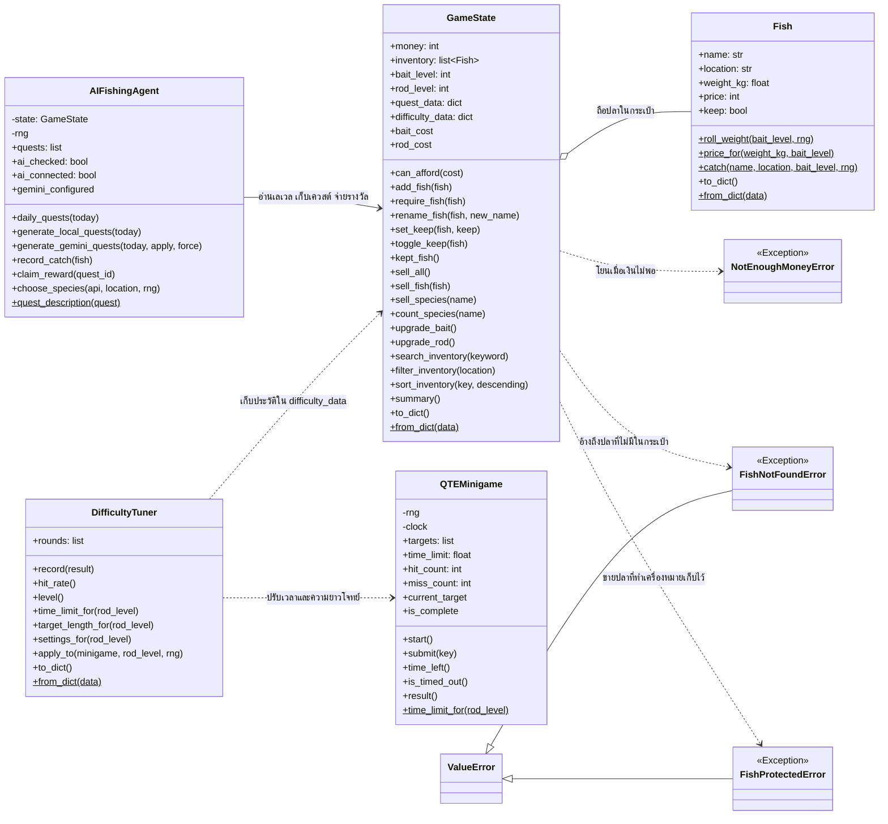
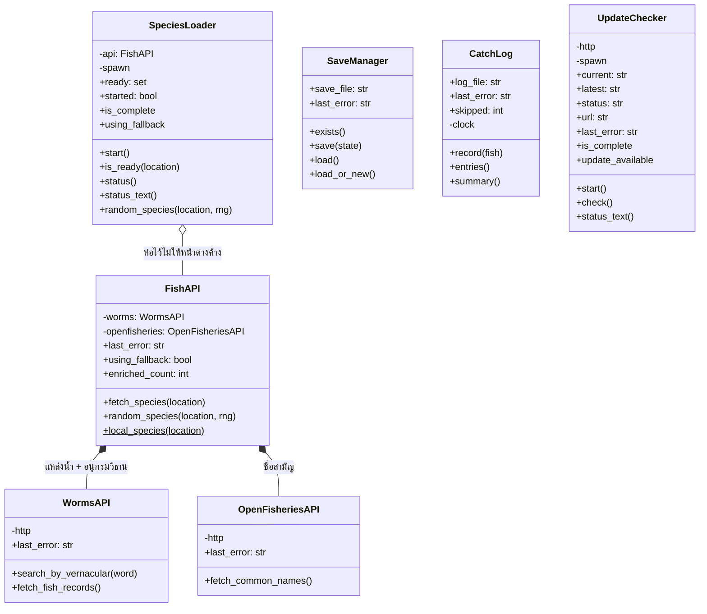
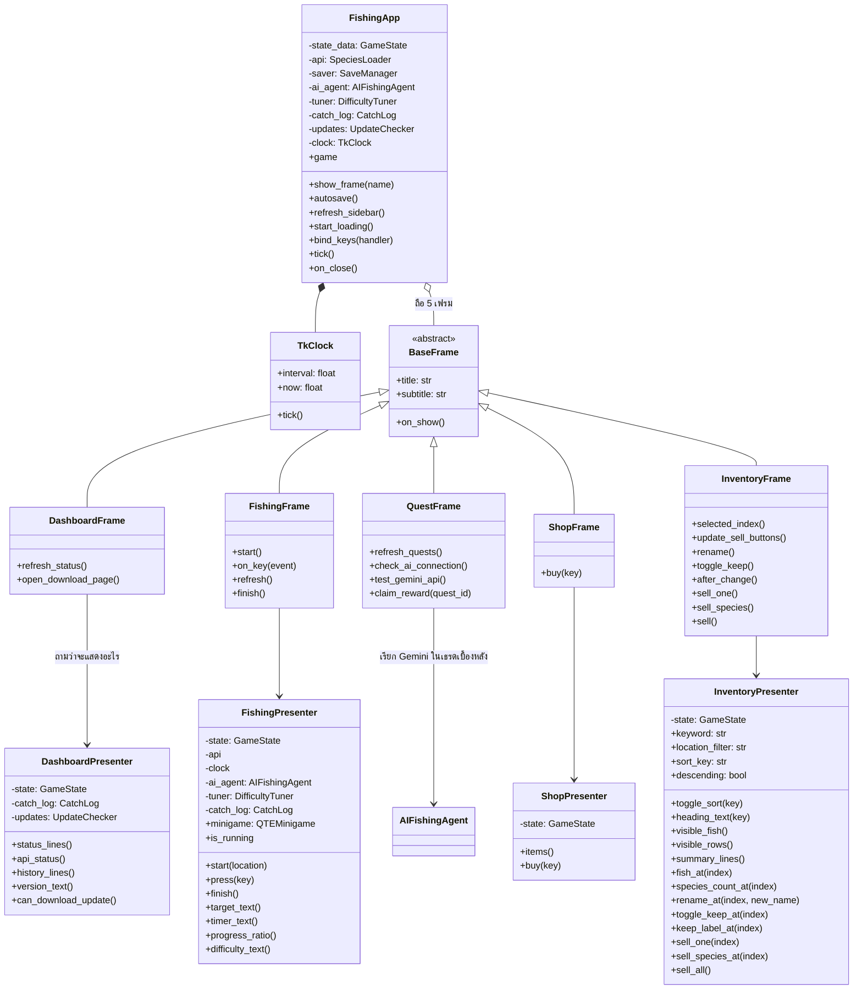
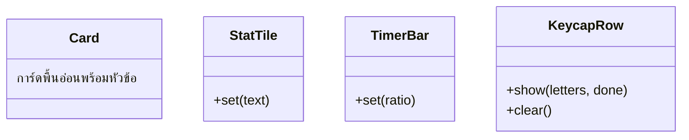
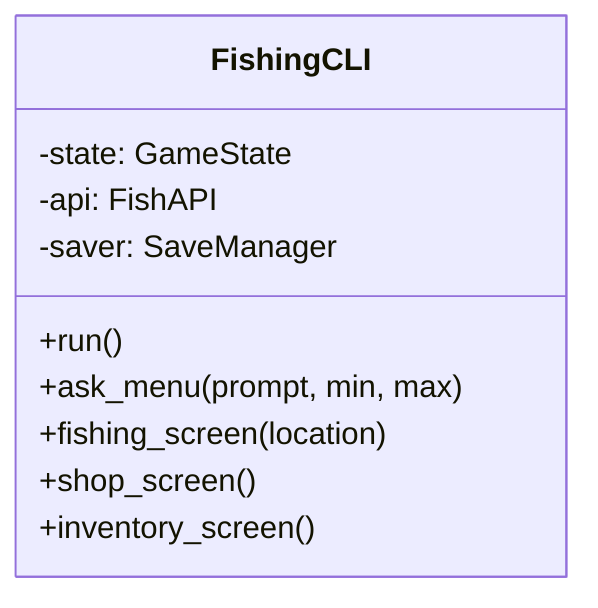
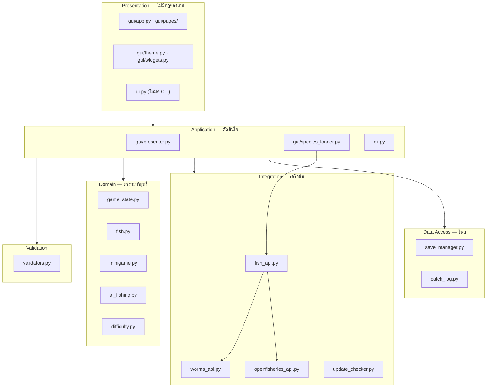
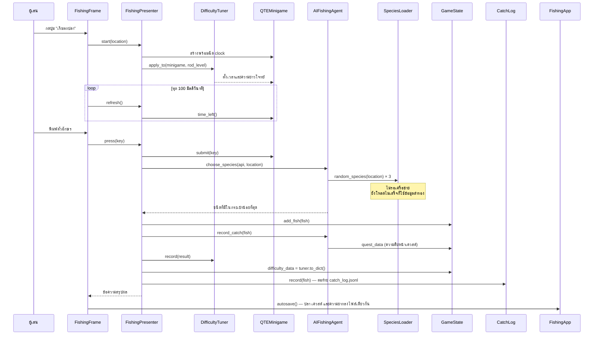
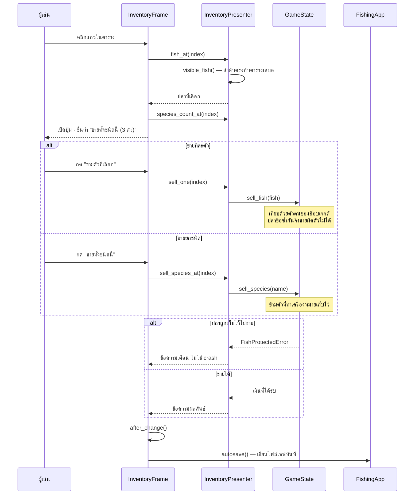
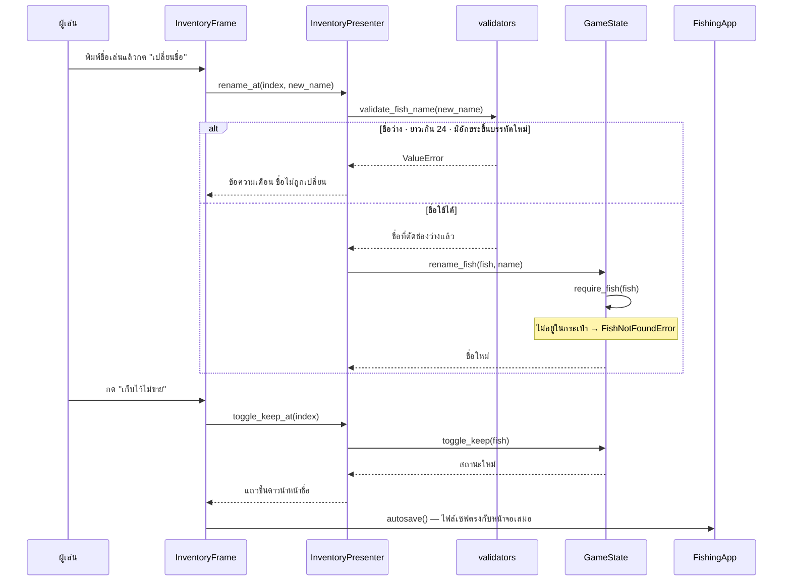

# UML Class Diagram — HOW_DO_YOU_FISH

แผนผังนี้สร้างจากโค้ดจริงในเวอร์ชันปัจจุบัน ไม่ใช่ผังที่วาดไว้ตอนต้นเทอมแล้วไม่ได้อัปเดต
GitHub แสดงผล Mermaid ได้ในตัว จึงเปิดดูได้ทันทีโดยไม่ต้องติดตั้งอะไรเพิ่ม

---

## 1. ชั้นโดเมนและตรรกะของเกม

คลาสกลุ่มนี้ไม่รู้จักหน้าจอ ไฟล์ และเครือข่ายเลย จึงเขียน unit test ได้ครบทุกเมธอด

`AIFishingAgent` (v0.7.0) เรียก Gemini ได้แบบไม่บังคับ ถ้าเรียกไม่ได้จะสุ่มเควสต์ในเครื่อง
ส่วน `DifficultyTuner` (v1.0.0) ปรับเวลาและความยาวโจทย์จากภายนอกโดยไม่แก้ `QTEMinigame`
ทั้งสองคลาสเก็บข้อมูลไว้ใน `GameState` จึงบันทึกลงไฟล์เซฟเดียวกันกับเงินและกระเป๋าปลา

---

## 2. ชั้นเชื่อมต่อข้อมูลและไฟล์

`SpeciesLoader` มีหน้าตาเหมือน `FishAPI` ตรงที่มี `random_species()` และ `using_fallback`
จึงส่งเข้าไปแทนกันได้โดยไม่ต้องแก้ชั้นที่เรียกใช้

`UpdateChecker` (v1.0.0) ถาม GitHub Releases ในเบื้องหลังเหมือน `SpeciesLoader`
และมี `is_complete` เหมือนกัน `FishingApp` จึงรอทั้งสองตัวด้วยลูปเดียวกันก่อนรีเฟรชหน้าแรก

`CatchLog` (v1.0.0) เขียนต่อท้าย `data/catch_log.jsonl` บรรทัดละหนึ่งตัว
ส่วน `summarize()` เป็นฟังก์ชันล้วนระดับโมดูลที่สรุปสถิติจากรายการประวัติ

---

## 3. ชั้นหน้าจอ

`presenter.py` ตัดสินใจ ส่วนไฟล์ใน `pages/` วาด (หน้าละหนึ่งไฟล์) แยกกันเพื่อให้เทสต์รันบนเครื่องที่ไม่มีจอได้

### วิดเจ็ตที่วาดเอง

Tkinter ไม่มีรูปทรงเหล่านี้มาให้ จึงวาดเองด้วย `Canvas` ใน `src/gui/widgets.py`

`TimerBar` เปลี่ยนสีตามเวลาที่เหลือ (เขียว → ทอง → แดง) ผ่าน `theme.time_color()`
ส่วน `KeycapRow` ทำให้ตัวอักษรที่ต้องกดตอนนี้เรืองสีหลัก

### โหมดสำรองแบบ Terminal

`FishingCLI` ใน `src/cli.py` เป็นชั้นแสดงผลอีกตัวที่ยังคงไว้จาก Sprint 1-2
เรียกใช้ `GameState` · `QTEMinigame` · `FishAPI` ชุดเดียวกับ GUI ทุกประการ
เปิดด้วย `python main.py --cli` และ `main.py` จะถอยมาใช้ตัวนี้เองถ้าเปิดหน้าต่างไม่ได้

---

## 4. การแบ่งชั้น

ลูกศรชี้ทางเดียวลงล่างเสมอ ชั้นล่างไม่รู้จักชั้นบน
`game_state.py` จึงไม่รู้ว่ามีหน้าจอ และ `fish.py` ไม่รู้ว่ามี API
`ai_fishing.py` เป็นข้อยกเว้นเดียวที่ชั้นโดเมนเรียกเครือข่ายเอง (Gemini) แต่ไม่ import tkinter
และทุกเส้นทางที่เรียกไม่สำเร็จมีโหมดสำรอง

---

## 5. จุดที่ฉีดของเข้ามาจากภายนอก (Dependency Injection)

จุดที่ทดสอบยากที่สุดคือ **เครือข่าย เวลา การสุ่ม และเธรด** ทั้งหมดถูกออกแบบให้แทนที่ได้
ตั้งแต่ตอนเขียนโค้ด ไม่ใช่มาแก้ทีหลัง

| คลาส | สิ่งที่ฉีดเข้ามา | ตอนเล่นจริง | ตอนทดสอบ |
|---|---|---|---|
| `WormsAPI` · `OpenFisheriesAPI` | `http` | โมดูล `requests` | `FakeHttp` |
| `FishAPI` | `worms` · `openfisheries` | ตัวจริง | `FakeWorms` · `FakeOpenFisheries` |
| `SpeciesLoader` | `spawn` | `threading.Thread` | `ManualSpawn` ที่สั่งรันเองได้ |
| `QTEMinigame` | `clock` | `TkClock` (GUI) หรือ `time.monotonic` (CLI) | นาฬิกาจำลอง |
| `QTEMinigame` · `Fish` | `rng` | โมดูล `random` | `FakeRng` ที่คืนค่าเดิมทุกครั้ง |
| `AIFishingAgent` | `rng` · `requests.post` · `GEMINI_API_KEY` | โมดูล `random` · Gemini จริง · ค่าใน `.env` | ตัวสุ่มปลอม · `FakePost` ผ่าน `monkeypatch` · ลบ key ออก |
| `FishingPresenter` | `ai_agent` · `tuner` | ตัวจริงจาก `FishingApp` | ไม่ส่ง (ต้องเล่นได้เหมือนเดิม) หรือส่งตัวจริงพร้อมข้อมูลกำหนดเอง |
| `SaveManager` | `save_file` | ไฟล์ใน `data/` | `tmp_path` ของ pytest |
| `CatchLog` | `log_file` · `clock` | `data/catch_log.jsonl` · เวลาจริง | `tmp_path` · นาฬิกาที่คืนเวลาคงที่ |
| `UpdateChecker` | `http` · `spawn` · `current` | `requests` · `threading.Thread` · `src.__version__` | `FakeHttp` · `spawn` ที่เก็บงานไว้สั่งรันเอง · เวอร์ชันที่กำหนดเอง |
| `FishingApp` | `state` · `api` · `saver` | ของจริงทั้งหมด | สถานะและตัวเซฟปลอมใน smoke test |

ผลคือชุดทดสอบทั้งหมดรันแบบออฟไลน์ ไม่แตะไฟล์จริง ไม่รอเวลาจริง
ไม่สร้างเธรดจริง และไม่เปิดหน้าต่างจริง

---

## 6. เส้นทางของข้อมูลหนึ่งรอบการเล่น

---

## 7. เส้นทางการขายปลา

---

## 8. เส้นทางการแก้ไขข้อมูลปลา (Update)

ส่วน **U** ของ CRUD เพิ่มใน Sprint 3 — การตรวจชื่ออยู่ชั้น Validation
ส่วนกฎว่าปลาตัวไหนแก้ได้อยู่ชั้น Domain หน้าจอไม่ตัดสินใจเองเลย

---

## 9. จังหวะการบันทึกไฟล์

ข้อกำหนดคือข้อมูลในหน่วยความจำต้องตรงกับไฟล์ตลอดเวลา
จึงเขียนลงไฟล์**ทันทีที่สถานะเปลี่ยน** ไม่ใช่รอตอนปิดโปรแกรม

| เหตุการณ์ | ผู้เรียก |
|---|---|
| จับปลาได้ | `FishingFrame.finish()` |
| ซื้อของสำเร็จ | `ShopFrame.buy()` |
| ขาย · เปลี่ยนชื่อ · เก็บไว้ไม่ขาย | `InventoryFrame.after_change()` |
| รับรางวัลเควสต์ · ได้ชุดเควสต์ใหม่ | `QuestFrame.claim_reward()` · `QuestFrame.refresh_quests()` |
| ปิดหน้าต่าง | `FishingApp.on_close()` |

ทุกช่องเรียก `FishingApp.autosave()` ตัวเดียวกัน จุดบันทึกจึงอยู่ที่เดียว
ไม่กระจายไปตามเฟรม และเพราะ `quest_data` กับ `difficulty_data` อยู่ใน `GameState`
การบันทึกครั้งเดียวจึงเขียนเงิน กระเป๋าปลา เควสต์ และประวัติความยากลง `save_game.json` พร้อมกัน
เงินรางวัลกับเครื่องหมาย "รับรางวัลแล้ว" จึงไม่มีทางอยู่คนละไฟล์จนกดรับซ้ำได้

ข้อยกเว้นเดียวคือ `catch_log.jsonl` ที่ `FishingPresenter.finish()` ต่อท้ายทันทีที่จับได้
เพราะเป็นบันทึกเหตุการณ์ที่ไม่มีค่าใดในไฟล์เซฟอ้างอิงถึง
